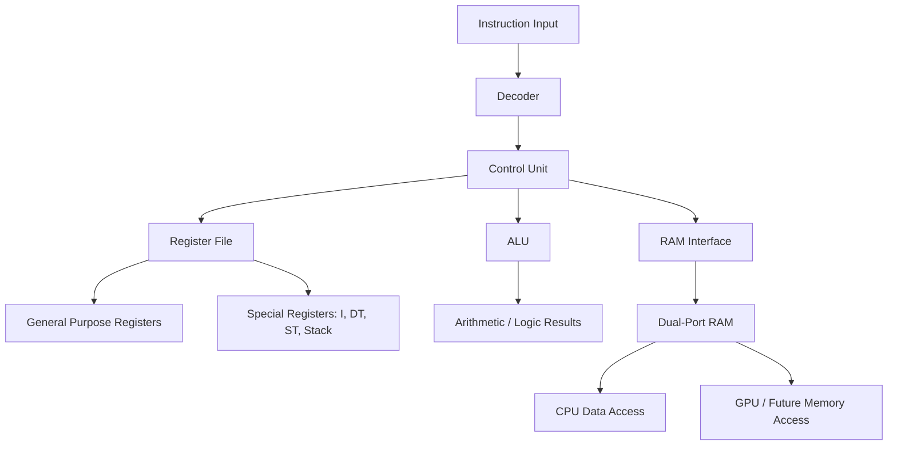
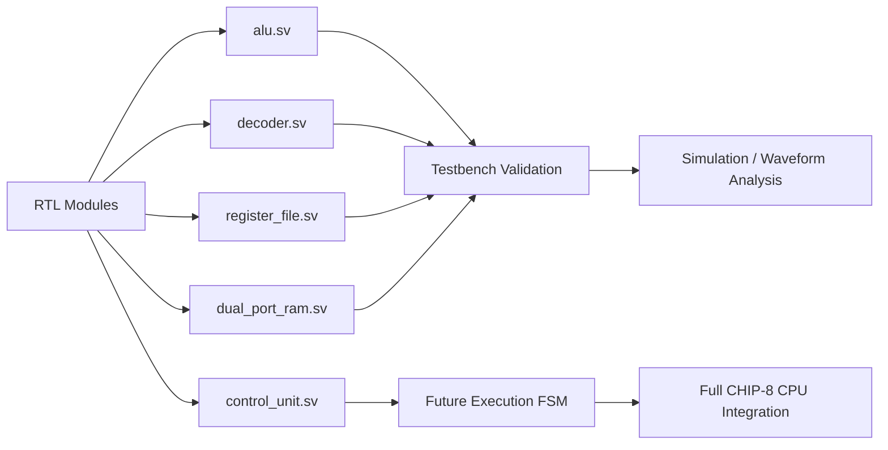

# CHIP-8 Hardware Project

This project is a hardware-focused CHIP-8 implementation built with SystemVerilog and simulated using Verilator. It targets a small, modular CPU design with separate functional blocks for arithmetic, decoding, register handling, and memory access. The goal is to model the CHIP-8 instruction set in a way that is easy to test and extend, while providing waveform-based debugging and a lightweight build flow.

The repository includes RTL modules, testbenches, and build automation for running simulations on Linux or WSL. The design is intended for learning, architecture exploration, and verification of hardware behavior before moving toward a more complete SoC-style implementation.

## Overview

The project centers on a CHIP-8-inspired processor architecture and includes:

- An arithmetic logic unit for instruction execution
- A decoder for 16-bit CHIP-8 instruction decoding
- A register file for CPU state and special registers
- A dual-port RAM block for memory access patterns
- Testbenches for validating individual functional blocks
- Verilator-based simulation and waveform support

The design is structured around hardware verification principles, with focus on correctness, clear module boundaries, and repeatable simulation runs.

## Requirements

To build and run the project, the following tools are required:

- Linux or WSL environment
- GNU Make
- Verilator
- GCC or compatible C++ toolchain for compiled simulation outputs
- GTKWave for waveform viewing (optional, but used for inspecting VCD output)
- A shell environment compatible with the provided Makefile

### Recommended installation

On Ubuntu or Debian-based systems, the essential packages are typically installed with:

```bash
sudo apt update
sudo apt install build-essential verilator gtkwave make
```

On Arch Linux, install the required toolchain with:

```bash
sudo pacman -Syu
sudo pacman -S base-devel verilator gtkwave make
```

If you are using an Arch-based distribution with `pacman`, this is the expected build setup for the same Verilator flow.

> The project is explicitly Linux/WSL-only and uses the Verilator flow defined in the Makefile.

## Building and Running

From the project root, you can use the provided Makefile targets:

```bash
make
```

This builds and runs the default simulation target.

### Useful targets

```bash
make lint
make test_alu
make test_decoder
make test_register_file
make test_dual_port_ram
make waves
make clean
```

The `make lint` target performs static lint checking, while the test-specific targets compile and run focused simulations for individual modules. The waveform view command opens generated `.vcd` files in GTKWave for debugging.

## Verification

The project is designed around modular verification, where each subsystem is tested independently before broader integration. This helps detect issues early in the RTL development cycle and keeps simulation output manageable.

Typical verification steps include:

1. Running the lint target to catch structural issues.
2. Running module-specific testbenches for ALU, decoder, register file, and RAM blocks.
3. Inspecting generated waveforms when debugging timing or logic behavior.

## Notes

This project is a hardware design and verification repository, so it is best suited for users who are comfortable with RTL simulation, Make-based build flows, and waveform debugging. It is intended as a practical learning and development platform for CHIP-8-style CPU and memory modeling rather than a full software emulator.

## License

This project does not currently declare a specific license in the repository. If you plan to distribute or reuse it publicly, add an appropriate license file before publishing.

## progess status trackers

| Title | Status | Notes |
| :--- | :--- | :--- |
| ALU module | Implemented | Arithmetic and bitwise operations are present and cover CHIP-8-style logic and shifting behavior. |
| Decoder module | Implemented | Decodes the main instruction classes, including jumps, loads, stores, ALU ops, and video/keyboard control. |
| Register file | Implemented | Includes V registers, I, DT, ST, and stack logic for CHIP-8 state management. |
| Dual-port RAM | Implemented | Memory block supports CPU write access and GPU read access; current implementation is a working prototype. |
| Control unit | In Progress | Skeleton exists and defines the intended CPU control interface, but execution FSM and full control logic are not complete. |
| Verification testbenches | Implemented | Focused tests exist for ALU, decoder, register file, and RAM modules. |
| GPU / display pipeline | Planned | Not yet implemented in the RTL, as indicated by the project roadmap and next-step documentation. |
| Full SoC integration | Planned | CPU, memory, GPU, and display integration is still part of the future architecture roadmap. |




