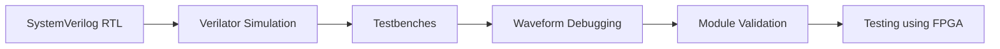

# Project Documentation

This folder contains the main documentation for the CHIP-8 hardware project. The files are organized into small, easy-to-follow sections so that the design, setup, and current status are clear without needing to read the whole codebase at once.

## Documentation index

- [Overview](overview.md) — what the project is and what it is trying to implement
- [Build and Run](build-and-run.md) — required tools and commands to build simulations
- [Architecture](architecture.md) — how the main RTL blocks connect and work together
- [Progress Status](progress-status.md) — current implementation status and roadmap
- [Next Steps](next_steps.md) — extended design plan and future work

## Quick summary

This project is a hardware-oriented CHIP-8 implementation written in SystemVerilog. It uses Verilator for simulation and focuses on verifying individual blocks like the ALU, decoder, register file, and RAM before moving toward a full CPU or SoC implementation.

