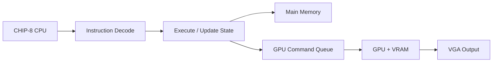

# CHIP-8 Hardware Project Documentation

This documentation set describes the current direction of the project: a hardware-oriented CHIP-8 implementation in SystemVerilog, designed around modular verification and a future SoC-style architecture.

## Documentation map

- [Overview](overview.md) — high-level summary of the project and current implementation stage
- [Architecture](architecture.md) — top-level system organization and signal flow
- [CPU](cpu.md) — execution model, control path, and CPU responsibilities
- [PPU](ppu.md) — graphics pipeline, draw/clear behavior, framebuffer design, and VGA scanout
- [Main Memory](main-memory.md) — memory ownership, access rules, and system-level device interaction
- [Opcodes](opcodes.md) — complete CHIP-8 opcode reference
- [Next Steps](next_steps.md) — project roadmap and future implementation plan

## Quick summary

The repository already contains working RTL modules for the ALU, decoder, register file, and RAM prototype. The missing major step is the control unit and higher-level system integration, which is the focus of the architecture documented here.

