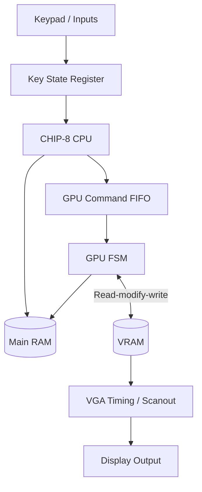
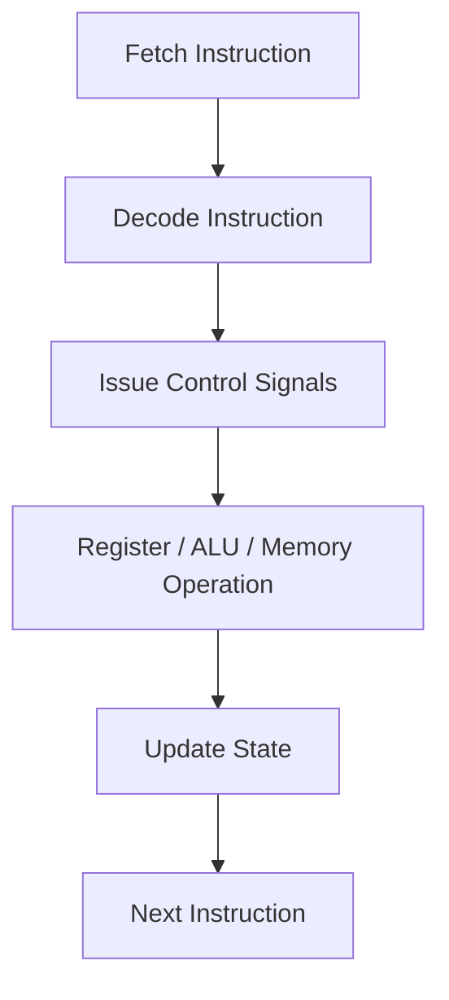

# Architecture

The project is organized around a small CHIP-8 hardware architecture with separate blocks for execution, memory, and graphics. The target design is not just a single monolithic module; it is intended to be a clean SoC-like layout with a CPU core, RAM, and GPU/display sub-system.

## Top-level structure

## Main components

### CPU block
The CPU is responsible for instruction fetch, decode, execution, register updates, and control signals. It communicates with memory and, in the future, with the GPU through queued drawing commands.

### Main RAM
The main RAM holds the program, data, fonts, and other memory-mapped data. It is expected to serve the CPU directly and also provide sprite data to the GPU.

### PPU and VRAM
The PPU consumes drawing and clear commands, reads sprite data from RAM, and writes to VRAM. This keeps the display pipeline separate from CPU execution and supports a clean draw/clear state machine.

### Display path
The display logic converts VRAM into a 64x32 pixel map and scales it to a VGA output frame. The design aims to follow the classic CHIP-8 mapping model, using a display controller for active video and blanking.

## Control flow

## Current implementation status

The repository already includes a working ALU, decoder, register file, and RAM prototype. The remaining structural work is centered on the control unit, FIFO, GPU, VRAM, and the final top-level integration.

This architecture reflects the intended final direction of the project, even though the full system is not yet complete in RTL.
