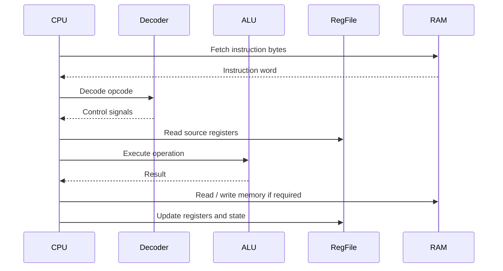
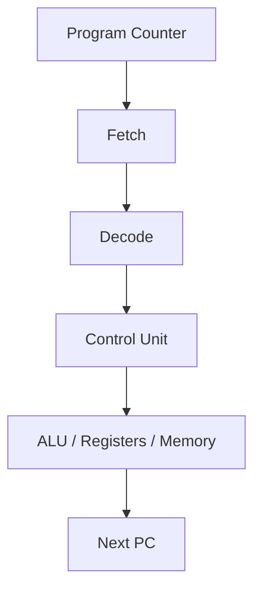

# CPU

The CPU is the core execution unit of the CHIP-8 design. It is responsible for reading instructions, decoding them, running the corresponding logic, and updating the processor state.

## Main responsibilities

The CPU needs to handle:

- instruction fetch from memory
- instruction decode
- register reads and writes
- ALU operation execution
- branch and call behavior
- timer management
- memory access requests
- keyboard wait states

## Execution model

A simplified execution cycle looks like this:

## Current codebase status

The current repository already contains:

- a working ALU
- a working decoder
- a register file implementation
- a RAM prototype

This means the CPU is partly implemented at the module level, but a complete control-unit-driven execution pipeline still needs to be finished.

## Key design goals

The CPU design should support:

- normal PC increment
- jumps and subroutine calls
- skip instructions
- memory store and load operations
- timer behavior
- key wait logic
- future GPU command generation

## Planned CPU features

The final CPU is expected to include:

- a fetch-decode-execute loop
- explicit control-unit state transitions
- memory wait handling
- PC and stack management
- draw command generation for the GPU
- keyboard synchronization for `EX9E`, `EXA1`, and `FX0A`

