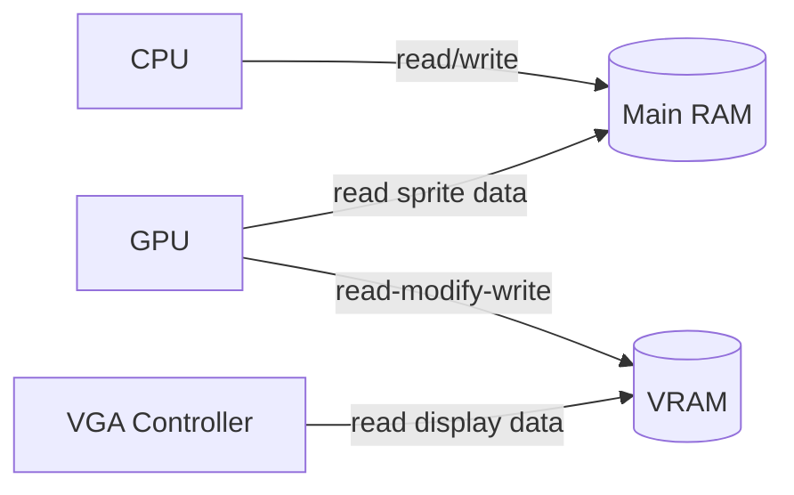
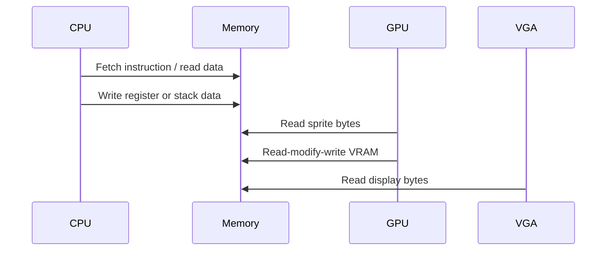

# System Dual Port Memory

The memory system is one of the central parts of the CHIP-8 SoC design. The main goal is to allow the CPU and GPU to access memory without interfering with each other in an unsafe way.

## Memory model

The target design has two main memory regions:

- main RAM for CPU data and instruction storage
- VRAM for pixel display storage

The system should allow the CPU to read and write the program/data memory while the GPU reads sprite data and writes display data into VRAM.

## Dual-port concept

The project already includes a dual-port RAM prototype, but the future design requires a more disciplined interface. The memory should be able to support:

- CPU access to main memory
- GPU access to sprite memory
- display read of VRAM
- controlled arbitration when multiple devices want access at the same time

## Access rules

The intended behavior is:

1. CPU owns program/data accesses in the main RAM.
2. GPU reads sprite bytes from main RAM when drawing.
3. GPU writes to VRAM with proper read-modify-write sequencing.
4. VGA reads from VRAM for output generation.
5. Conflicting access patterns must be controlled with arbitration or explicit timing rules.

## Why this matters

Without a clear memory access model, the CPU and GPU can easily conflict. That can lead to:

- stale data reads
- incorrect sprite drawing
- invalid VRAM updates
- unstable display output

## Planned memory design

The final design is expected to define:

- explicit read/write ports
- memory ownership rules
- proper read-during-write behavior
- synchronization between CPU and GPU accesses
- separate address spaces for main RAM and VRAM

This is still part of the future architecture roadmap and is not yet fully implemented in the repository.
