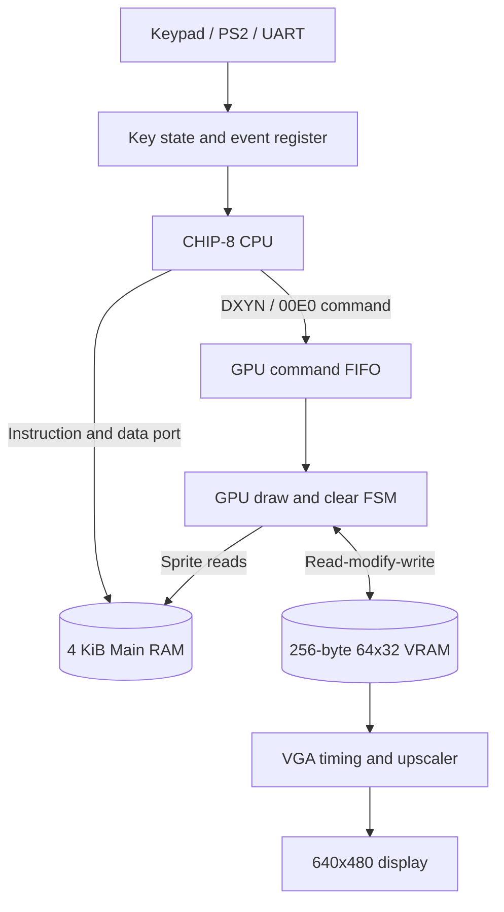
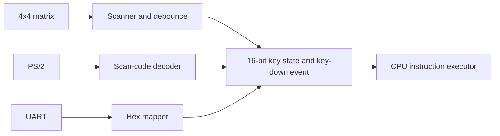
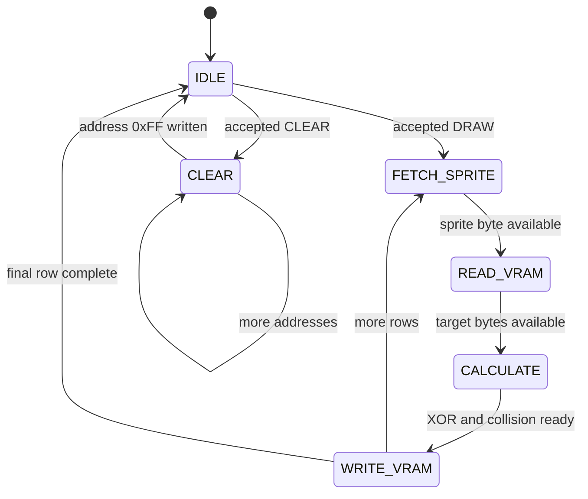

# CHIP-8 Hardware SoC: Architecture and Handoff Plan

This document describes the intended CHIP-8 SoC and the work required to reach
it. It is a design specification and implementation plan, not a claim that all
of these blocks already exist.

## 0. Current Repository Status

| Block | Current state | Notes |
| :--- | :--- | :--- |
| `alu` | Implemented and unit-tested | Combinational ALU operations and VF-related result bits. |
| `decoder` | Implemented and exhaustively unit-tested | Decodes all 65,536 possible 16-bit instruction values. |
| `register_file` | Implemented and unit-tested | V0-VF, I, delay timer, sound timer, and a 16-entry stack. |
| `dual_port_ram` | Prototype and unit-tested | A 4 KiB byte array with a byte write path and an 8/16-bit read mode; it is not yet an independent dual-port CPU/GPU memory interface. |
| `control_unit` | Skeleton only | Fetch, decode, execute, PC, stack, timers, and memory control are not implemented. |
| GPU, FIFO, VRAM, keypad, VGA, top level | Not implemented | These remain planned blocks. |

The build is Verilator-based and Linux/WSL-only. Use the testbench names under
`testbench/`. There is currently no `testbench/tb.sv`, so the Makefile's
default `make` target is not a valid end-to-end test until a default testbench
is added or the Makefile is changed.

## 1. Target SoC Architecture

The completed design should separate the CPU, main memory, graphics engine,
framebuffer, keyboard input, and display timing. The CPU may enqueue drawing
commands while the GPU performs row-by-row memory operations.



Use an explicit `cmd_valid`/`cmd_ready` handshake. A command is accepted only
when both are high; `gpu_busy` alone does not describe FIFO capacity.

### 1.1 Clocking

Start with one synchronous core clock for CPU, GPU, RAM, and VRAM. If a
separate pixel clock is required, define a dual-clock RAM strategy and clock
domain crossing rules; an asynchronous read is not a safe clock crossing.

For 640x480 VGA, the conventional pixel clock is 25.175 MHz. The total timing
area is 800 pixels by 525 lines, with 640 by 480 active pixels. Generate the
clock with a PLL/MMCM and hold reset until generated clocks are stable.

## 2. Keyboard Subsystem

Expose a 16-bit vector to the CPU. `key_state[N] = 1` means hexadecimal key N
is held, and `0` means released. Also expose a key-down event or edge detector
for `FX0A`; a level-only priority encoder can return the same held key forever.



The matrix scanner must debounce keys and define simultaneous-key behavior.
For simulation, drive the same state and event interface from the testbench.

1. `EX9E` (`SKP Vx`) skips when `key_state[Vx]` is set, so PC advances 4 bytes.
2. `EXA1` (`SKNP Vx`) skips when `key_state[Vx]` is clear.
3. `FX0A` (`LD Vx, K`) holds the instruction until a defined key-down event,
   writes the key value to `Vx`, and then advances PC.

Define behavior for unknown or out-of-range vector indexes in simulation,
although valid CHIP-8 encodings only address keys 0 through 15.

## 3. Memory and Address Map

CHIP-8 addresses are 12 bits and main RAM is 4,096 bytes:

| Region | Address | Purpose |
| :--- | :--- | :--- |
| Main RAM | `0x000-0xFFF` | Fonts, reserved space, program, and data. |
| Font set | Conventionally `0x050-0x09F` | 16 five-byte hexadecimal glyphs, if selected. |
| Program entry | Conventionally `0x200` | Initial PC for ordinary CHIP-8 programs. |
| VRAM | `0x00-0xFF` | 256 bytes, eight pixels per byte, 64x32 display. |

Make the font base and program loading policy documented parameters or
constants, not assumptions hidden in unrelated blocks.

### 3.1 Required Memory Interfaces

The target requires CPU/main-RAM access for fetches and `FX33`/`FX55`/`FX65`,
GPU/main-RAM reads for sprite bytes, GPU VRAM read-modify-write access, and
display VRAM reads.

The current `dual_port_ram` uses one address, a bidirectional data bus, and an
`always_latch` write model. Replace it with explicit input/output signals,
synchronous writes, documented read-during-write behavior, and two independent
ports. Verify addresses `0x000` and `0xFFF` without allowing `address + 1` to
wrap or access outside the array.

## 4. CPU Execution Rules

Fetch one 16-bit instruction from two consecutive bytes, decode it, execute it,
and update state. Normal PC increment is 2 bytes; a taken skip adds another 2,
for a total of 4. Reset must establish:

* `PC = 0x200` (or a documented configurable entry point).
* `I = 0`, `SP = 0`, `DT = 0`, and `ST = 0`.
* V registers, stack, CPU, FIFO, and display control in defined states.

The control unit must implement fetch, decode/execute, memory wait states,
calls, returns, skips, timers, and the keyboard wait state. `DT` and `ST`
decrement at 60 Hz independently of instruction rate. Document the sound
output policy even if the first target only exposes `sound_active`.

## 5. GPU: `DXYN` and `00E0`

The GPU is an asynchronous command consumer. Dispatch can complete in one
accepted cycle, but drawing requires multiple cycles for sprite reads, VRAM
reads, XOR calculation, collision tracking, and writes.

### 5.1 Command Format

The original 21-bit payload is too small for the listed fields. Even two 4-bit
X/Y fields plus 12-bit I, 4-bit height, and 2-bit type require 26 bits. CHIP-8
coordinates are normally 8-bit values. Use this 34-bit first implementation:

```text
command[33:32]  type       2 bits  (DRAW or CLEAR)
command[31:24]  x          8 bits  (wrapped modulo 64)
command[23:16]  y          8 bits  (wrapped modulo 32)
command[15:12]  height     4 bits  (N)
command[11:0]   index      12 bits (I)
```

A narrower format is possible, but it must state where normalized 6-bit X and
5-bit Y values are produced.

### 5.2 Draw Semantics

For each sprite row:

$$\mathrm{pixel}_{new} = \mathrm{pixel}_{old} \oplus \mathrm{pixel}_{sprite}$$

Set `VF` if any 1 bit changes to 0:

$$VF = \bigvee(\mathrm{pixel}_{old} \land \mathrm{pixel}_{sprite})$$

Wrap `x = Vx mod 64` and `y = Vy mod 32`. A non-zero horizontal byte offset
touches two adjacent VRAM bytes, and the second byte wraps at the right edge.
Preserve the collision result until the CPU has a defined way to consume it.
`00E0` clears all 256 VRAM bytes and has a completion condition.



## 6. CPU/GPU Hazards and FIFO

Use a four-entry FIFO initially, with valid/ready, full/empty, and occupancy
tests. Handle these cases:

1. A draw is issued while the FIFO is full.
2. Software reads or branches on `VF` before its draw completes.
3. Software changes `I` while a queued draw depends on it.
4. Clear and draw ordering must be preserved.

The simplest policy is to snapshot all draw parameters, including `I`, when
enqueuing and stall instructions that consume `VF` until the relevant draw
completes. Any forwarding or retirement alternative must be documented and
tested.

## 7. VGA Output

For active video, scale 64x32 to 640x480 by 10 horizontally and 15 vertically:

```text
chip_x       = floor(vga_x / 10)
chip_y       = floor(vga_y / 15)
vram_address = chip_y * 8 + floor(chip_x / 8)
bit_index    = 7 - (chip_x mod 8)
```

Here `vga_x` is 0-639 and `vga_y` is 0-479. Outside active video, output black
and generate the selected HSYNC/VSYNC polarity. Account for RAM read latency;
a synchronous VRAM read usually requires a one-clock output pipeline.

## 8. Verification and Handoff Checklist

Run focused tests after each block:

```text
make lint
make test_alu
make test_decoder
make test_register_file
make test_dual_port_ram
```

Add tests in this order:

1. Control-unit reset, fetch, PC updates, skips, calls, returns, and waits.
2. Timer ticks at 60 Hz and sound-timer behavior.
3. Keyboard state/events, `EX9E`, `EXA1`, and blocked `FX0A`.
4. VRAM drawing at x offsets 0 and 1, both edges, vertical wrap, collisions,
   and clear.
5. FIFO ordering, full/empty transitions, `I` snapshotting, and `VF` hazards.
6. VGA address mapping, blanking, sync timing, and read latency.
7. An integration ROM covering fonts, sprites, input, and timers.

Every testbench should exit non-zero on failure. Preserve VCD output for
failures and document simulator versions and board timing constraints.

## 9. Recommended Implementation Order

1. Replace the RAM prototype with explicit synthesizable ports and agree on
   read latency.
2. Complete the control unit around the existing decoder, ALU, and register
   file; add a CPU integration testbench.
3. Add fonts, program loading, timers, and keyboard interfaces.
4. Implement VRAM and the GPU FSM, then add FIFO and hazard policy.
5. Implement VGA timing and scanout with the selected clocking scheme.
6. Add the top-level SoC, board constraints, clock/reset generation, and an
   end-to-end ROM test.

Optimize for inferred BRAM, vendor RAM primitives, higher frequency, or a
separate pixel clock only after simulation passes.
