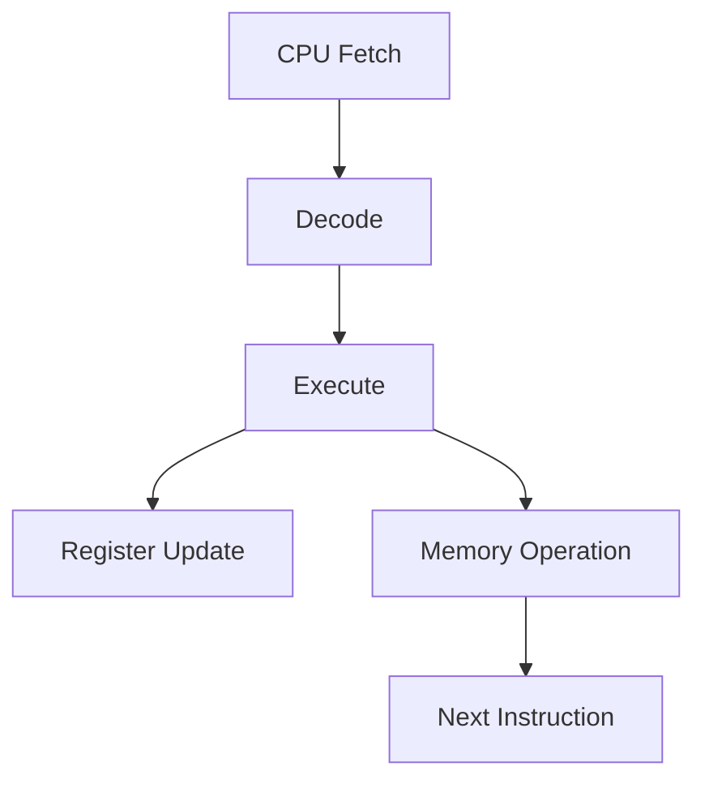

# Overview

This project is a hardware implementation of the CHIP-8 instruction set in SystemVerilog. It is designed to behave like a real digital system rather than a software emulator, with a focus on modular RTL design, simulation, and debugging.

## What is already present

The current codebase includes:

- ALU logic for arithmetic and bitwise operations
- A decoder that identifies key CHIP-8 instruction groups
- A register file for general-purpose registers and special state
- A RAM prototype for memory reads and writes
- Testbenches for isolated block validation

## What is still being built

The next major milestone is to complete the control unit and connect the CPU, memory, GPU, VRAM, and display path into a working SoC-style design. At present, the repository is at the stage where the individual building blocks are available, but the full execution pipeline is still under construction.

## Design goals

The project aims to:

- model CHIP-8 behavior in hardware
- keep blocks small and testable
- validate each module before integration
- support future GPU, VRAM, keyboard, and VGA work

