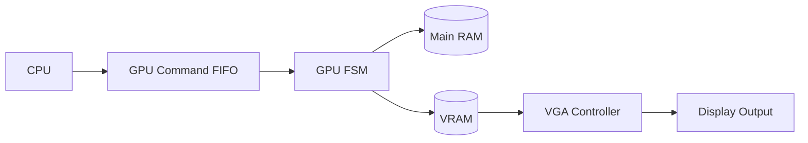
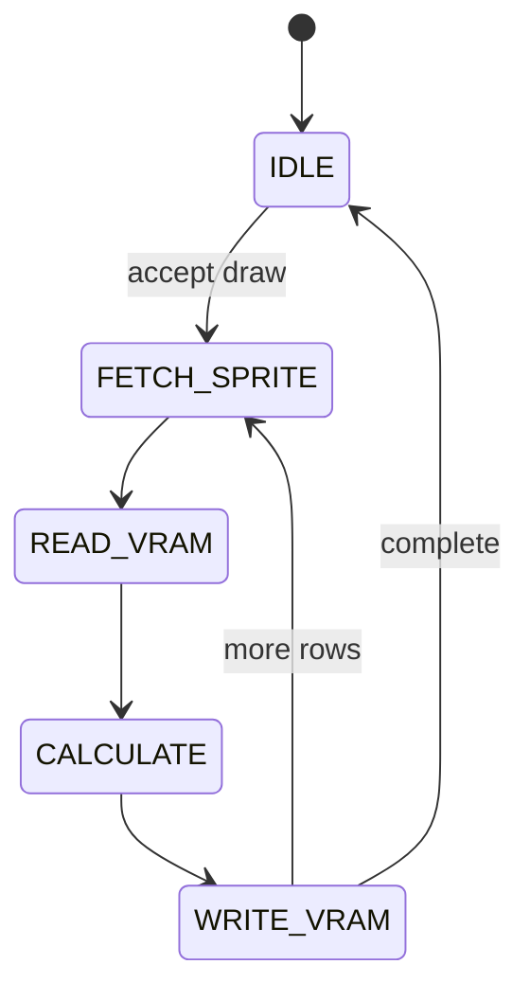
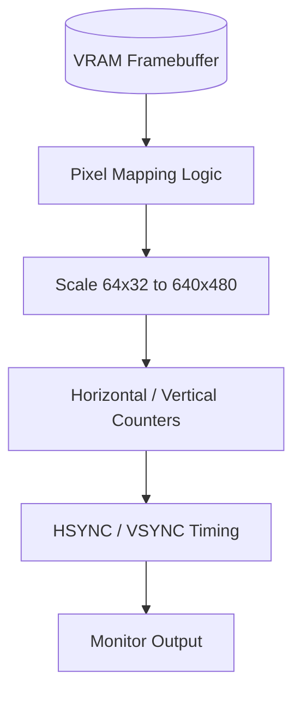

# GPU and VRAM

The GPU and VRAM are responsible for drawing graphics, clearing the screen, and managing the display buffer. In the target architecture, the GPU is separated from the CPU so that drawing can happen in a controlled, asynchronous fashion.

## Purpose

The GPU handles:

- draw commands (`DXYN`)
- clear commands (`00E0`)
- sprite reads from RAM
- read-modify-write operations on VRAM
- collision tracking for draw operations
- handing updated display data to the VGA controller

## VRAM role

VRAM stores the current display state as a 64x32 pixel map. It is separate from the main RAM so the CPU can continue executing instructions while the graphics engine updates the screen contents.



## Draw flow

A draw operation usually follows this sequence:

1. CPU issues a draw command
2. GPU accepts the command from the FIFO
3. GPU reads sprite data from main RAM
4. GPU reads the target VRAM bytes
5. GPU performs XOR update and collision detection
6. GPU writes the updated bytes back to VRAM



## Why this separation matters

This design makes the display logic independent from the CPU execution path. It also helps preserve correct behavior for:

- command ordering
- collision tracking
- draw timing
- memory access isolation

## VGA controller overview

The VGA controller is not the same as the GPU. The GPU updates the display buffer; the VGA controller decides what to show on the screen at each moment.

Think of it like this:

- GPU = updates the image data
- VGA controller = scans the image and sends pixels to the monitor

The display is usually treated as a 64x32 CHIP-8 framebuffer, which is then scaled to a larger monitor resolution such as 640x480.



## How the VGA controller works

A VGA controller uses counters to track the current pixel position on the screen:

- `x` counts across the screen horizontally
- `y` counts vertically down the screen
- blanking intervals are skipped during sync periods
- active video is the region where pixels are shown

For a 640x480 display, the controller computes:

- the current screen position
- whether it is inside the active display region
- which pixel in the CHIP-8 framebuffer should be read

Example mapping logic:

```text
chip_x = floor(vga_x / 10)
chip_y = floor(vga_y / 15)
vram_address = chip_y * 8 + floor(chip_x / 8)
bit_index = 7 - (chip_x mod 8)
```

This means:

- one CHIP-8 pixel becomes a larger block on screen
- the framebuffer is read in a pattern based on the current VGA position
- each byte in VRAM stores 8 pixels horizontally

## Beginner-friendly intuition

If you imagine the screen as a large grid, the VGA controller is repeatedly asking:

- “Which pixel am I currently drawing?”
- “Is this inside the visible area?”
- “What bit from the CHIP-8 framebuffer should I show here?”

The answer is driven by counters and a lookup into VRAM. The GPU only changes the framebuffer contents; the VGA controller repeatedly scans it.

## Planned implementation steps

A beginner-friendly implementation order is:

1. Create a small VRAM array for 64x32 pixels
2. Build a simple framebuffer read function that maps `(x, y)` to a VRAM byte and bit
3. Add horizontal and vertical counters for screen scanout
4. Generate display enable, HSYNC, and VSYNC timing
5. Scale CHIP-8 coordinates into a 640x480 output region
6. Connect the VGA output to the display module

## Planned features

The final GPU design is expected to include:

- a command FIFO with ready/valid handling
- snapshotting of draw parameters such as `I`
- collision detection on pixel erase
- VRAM clear behavior for `00E0`
- a VGA controller for screen scanout

## Important note

This file describes the intended architecture, not a completed implementation. The current repository still contains the memory and CPU blocks, while the GPU, VRAM, and VGA controller are planned next steps.
